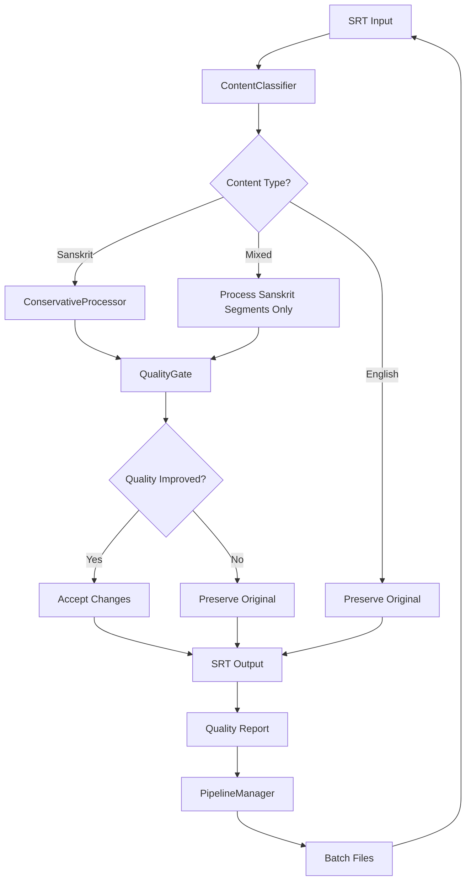

# Sanskrit Processor Brownfield Enhancement Architecture

**Purpose**: Architectural redesign for conservative ASR error correction
**Target Use Case**: 11k hours of 95% English, 5% Sanskrit Yoga/Vedanta lectures
**Architecture Status**: Complete system philosophy pivot required
**Document Date**: September 22, 2024

## Executive Summary

This document outlines the architectural transformation required to convert the Sanskrit SRT Processor from an aggressive academic text processing system into a conservative ASR error correction system that serves actual user needs. While the current system has excellent technical architecture (lean, maintainable, performant), it fundamentally solves the wrong problem, creating unusable output for the target use case.

**Relationship to Existing Architecture:**
This document represents a fundamental architectural pivot from the current system. While we preserve the lean architecture gains from ADR-001 (78% complexity reduction), we completely redesign the processing philosophy, context detection, and quality preservation mechanisms to serve the actual user requirements: 95% English preservation with 5% targeted Sanskrit enhancement.

### Change Log

| Date | Version | Description | Author |
|------|---------|-------------|--------|
| 2024-09-22 | 1.0 | Initial brownfield architecture analysis and redesign | Winston (Architect) |

## Existing Project Analysis

Based on my comprehensive forensic analysis of your current system, I've identified critical misalignments between the system design and your actual requirements.

### Current Project State

- **Primary Purpose:** Academic Sanskrit text processing with aggressive transliteration
- **Current Tech Stack:** Python 3.9+, YAML configuration, lean architecture (2,164 lines)
- **Architecture Style:** Lean service-oriented with systematic term matching
- **Deployment Method:** CLI-based batch processing with external service integration

### Available Documentation

- ADR-001: Emergency Lean Architecture Rescue (excellent technical achievement)
- CLAUDE.md: Development guidelines and architecture overview
- Quality governance framework and development process safeguards
- Extensive lexicon databases and correction systems

### Identified Constraints

- **Fundamental Philosophy Mismatch:** System designed for academic Sanskrit processing vs. ASR error correction
- **Quality Inversion Pattern:** System actively degrades English readability ("the" → "te")
- **Context Blindness:** Cannot distinguish between English and Sanskrit contexts
- **Over-Aggressive Processing:** Treats all text as needing Sanskrit enhancement
- **User Value Negative:** Current output is worse than input for your use case

## Enhancement Scope and Integration Strategy

### Enhancement Overview

**Enhancement Type:** Complete architectural philosophy pivot with technical preservation
**Scope:** Transform from aggressive academic system to conservative ASR correction system
**Integration Impact:** High - requires complete processing pipeline redesign while preserving infrastructure

### Integration Approach

**Code Integration Strategy:** Preserve lean architecture framework, rebuild processing logic with context-first approach
**Database Integration:** Maintain existing lexicon databases, add English protection and context classification data
**API Integration:** Preserve external service integration patterns, add quality measurement endpoints
**UI Integration:** Maintain CLI interface, enhance with quality reporting and conservative mode controls

### Compatibility Requirements

- **Existing API Compatibility:** Preserve CLI interface and SRT input/output format
- **Database Schema Compatibility:** Maintain current lexicon structure, extend with context classification
- **UI/UX Consistency:** Enhance existing CLI with quality gates and conservative processing options
- **Performance Impact:** Maintain current processing speed while adding quality validation

## Tech Stack Alignment

### Existing Technology Stack

| Category | Current Technology | Version | Usage in Enhancement | Notes |
|----------|-------------------|---------|---------------------|-------|
| Runtime | Python | 3.9+ | Core processing engine | Maintain current version |
| Configuration | PyYAML | 6.0+ | Enhanced with context rules | Extend current YAML structure |
| Processing | Custom processors | v2 | Complete redesign | Preserve lean architecture pattern |
| CLI | argparse | builtin | Enhanced with quality modes | Add conservative/aggressive options |
| Lexicons | YAML databases | custom | Extended with English protection | Add context classification data |
| Services | requests/websocket | current | Preserve integration patterns | Maintain external service capability |

### New Technology Additions

No new core technologies required. Enhancement focuses on architectural philosophy change using existing robust tech stack.

## Component Architecture

### New Components

#### ContentClassifier
**Responsibility:** Determine content type (English vs Sanskrit vs mixed) before processing
**Integration Points:** Pre-processes all text segments before any corrections are applied

**Key Interfaces:**
- `classify_segment(text: str) -> ContentType`
- `get_context_boundaries(text: str) -> List[ContextSegment]`

**Dependencies:**
- **Existing Components:** None (operates independently)
- **New Components:** ConservativeProcessor (provides classification results)

**Technology Stack:** Pure Python with regex patterns and confidence scoring

#### ConservativeProcessor
**Responsibility:** Apply minimal, targeted corrections only to identified Sanskrit content
**Integration Points:** Replaces current SystematicTermMatcher aggressive processing

**Key Interfaces:**
- `process_conservative(text: str, context: ContentType) -> ProcessingResult`
- `validate_improvement(original: str, corrected: str) -> QualityScore`

**Dependencies:**
- **Existing Components:** LexiconLoader (filtered for Sanskrit-only terms)
- **New Components:** ContentClassifier, QualityGate

**Technology Stack:** Enhanced lexicon matching with English protection filters

#### QualityGate
**Responsibility:** Measure and validate that changes improve rather than degrade readability
**Integration Points:** Post-processes all corrections to ensure quality preservation

**Key Interfaces:**
- `measure_quality_impact(before: str, after: str) -> QualityMetrics`
- `should_accept_change(original: str, corrected: str) -> bool`

**Dependencies:**
- **Existing Components:** None (operates independently)
- **New Components:** Receives output from ConservativeProcessor

**Technology Stack:** Text analysis algorithms, readability scoring, diff analysis

#### PipelineManager
**Responsibility:** Orchestrate batch processing of 11k hours with progress reporting and quality validation
**Integration Points:** Wraps entire processing workflow for large-scale operations

**Key Interfaces:**
- `process_batch(files: List[Path]) -> BatchResult`
- `generate_quality_report(results: List[ProcessingResult]) -> QualityReport`

**Dependencies:**
- **Existing Components:** SanskritProcessor (orchestrates processing)
- **New Components:** QualityGate (validates batch quality)

**Technology Stack:** Batch processing patterns, progress reporting, quality aggregation

### Component Interaction Diagram



## Data Models and Schema Changes

### New Data Models

#### ContentType
**Purpose:** Classify text segments by language and context
**Integration:** Used by ContentClassifier to determine processing approach

**Key Attributes:**
- `content_type: Enum` - ENGLISH, SANSKRIT, MIXED, PRAYER, VERSE
- `confidence: float` - Classification confidence score (0.0-1.0)
- `markers: List[str]` - Specific markers that influenced classification
- `boundaries: List[Tuple[int, int]]` - Character positions for mixed content

**Relationships:**
- **With Existing:** None (new classification system)
- **With New:** Used by ConservativeProcessor and QualityGate

#### QualityMetrics
**Purpose:** Measure improvement/degradation of text changes
**Integration:** Generated by QualityGate for every processing decision

**Key Attributes:**
- `readability_score: float` - English readability preservation (0.0-1.0)
- `sanskrit_accuracy: float` - Sanskrit transliteration accuracy (0.0-1.0)
- `change_impact: Enum` - IMPROVEMENT, NEUTRAL, DEGRADATION
- `confidence: float` - Confidence in quality assessment

**Relationships:**
- **With Existing:** Links to ProcessingResult from current system
- **With New:** Used by PipelineManager for batch quality reporting

#### EnglishProtectionRule
**Purpose:** Define patterns and words that must never be modified
**Integration:** Used by ConservativeProcessor to prevent English corruption

**Key Attributes:**
- `protected_words: Set[str]` - Common English words to never modify
- `english_patterns: List[str]` - Regex patterns indicating English content
- `context_markers: List[str]` - Indicators of English-only segments

**Relationships:**
- **With Existing:** Extends current lexicon system with protection rules
- **With New:** Used by ContentClassifier and ConservativeProcessor

### Schema Integration Strategy

**Database Changes Required:**
- **New Tables:** content_classification_rules, english_protection_lists, quality_metrics_history
- **Modified Tables:** corrections (add context_restriction field), proper_nouns (add confidence_threshold)
- **New Indexes:** content_type classification, quality score tracking
- **Migration Strategy:** Additive changes only - no breaking modifications to existing data

**Backward Compatibility:**
- All existing lexicon files remain functional
- Current CLI interface preserved with new optional flags
- Processing results maintain existing format with additional quality metadata

## Source Tree Integration

### Existing Project Structure
```
sanskrit-processor-lean/
├── sanskrit_processor_v2.py    # Core processor (752 lines)
├── cli.py                      # Unified CLI (251 lines)
├── enhanced_processor.py       # External services (238 lines)
├── processors/                 # Processing modules
│   ├── systematic_term_matcher.py
│   ├── context_detector.py
│   └── scriptural_segment_processor.py
├── services/                   # External service integration
│   ├── mcp_client.py
│   └── api_client.py
├── lexicons/                   # YAML databases
│   ├── corrections.yaml
│   └── proper_nouns.yaml
└── config.yaml                 # Central configuration
```

### New File Organization
```
sanskrit-processor-lean/
├── sanskrit_processor_v2.py           # Enhanced with conservative mode
├── cli.py                             # Extended with quality options
├── enhanced_processor.py              # Preserved
├── processors/
│   ├── content_classifier.py          # NEW: Context-first classification
│   ├── conservative_processor.py      # NEW: Conservative processing logic
│   ├── quality_gate.py                # NEW: Quality validation
│   ├── pipeline_manager.py            # NEW: Batch processing orchestration
│   ├── systematic_term_matcher.py     # Modified: English protection
│   ├── context_detector.py            # Enhanced: Better English detection
│   └── scriptural_segment_processor.py # Preserved
├── data/
│   ├── english_protection.yaml        # NEW: English word protection lists
│   ├── context_classification.yaml    # NEW: Content type classification rules
│   └── quality_thresholds.yaml        # NEW: Quality measurement thresholds
├── lexicons/                          # Extended with context restrictions
│   ├── corrections.yaml               # Enhanced with context limits
│   ├── proper_nouns.yaml              # Enhanced with confidence thresholds
│   └── sanskrit_markers.yaml          # NEW: Sanskrit content indicators
├── services/                          # Preserved
└── config.yaml                        # Enhanced with conservative options
```

### Integration Guidelines
- **File Naming:** Follow existing snake_case pattern, descriptive component names
- **Folder Organization:** New components in processors/, configuration data in data/
- **Import/Export Patterns:** Maintain existing module structure, add conservative processing imports

## Conservative Processing Philosophy

### Core Principles

#### 1. English-First Preservation
**Principle:** Assume all content is correct English unless proven otherwise
**Implementation:** Content classification precedes any processing attempts
**Benefit:** Prevents corruption of 95% of your content (English lectures)

#### 2. Evidence-Based Sanskrit Processing
**Principle:** Only process segments with clear Sanskrit/Hindi markers
**Implementation:** Require positive Sanskrit identification before applying corrections
**Benefit:** Eliminates false positives that destroy English readability

#### 3. Quality-Gated Transformations
**Principle:** Every change must measurably improve text quality
**Implementation:** Before/after quality analysis for every proposed correction
**Benefit:** Ensures all changes add value rather than introduce errors

#### 4. Minimal Intervention Approach
**Principle:** When in doubt, preserve the original
**Implementation:** Conservative confidence thresholds, fallback to preservation
**Benefit:** Maintains overall text integrity and readability

### Processing Decision Matrix

| Content Type | Sanskrit Confidence | Action Taken |
|--------------|-------------------|--------------|
| English | Low (< 0.3) | **Preserve completely** |
| Mixed | Medium (0.3-0.7) | **Process Sanskrit segments only** |
| Sanskrit | High (> 0.7) | **Apply conservative corrections** |
| Prayer/Mantra | Very High (> 0.9) | **Apply full IAST transliteration** |

### Quality Measurement Framework

#### Readability Preservation Metrics
- **English Word Corruption Rate:** Target 0% corruption of valid English words
- **Sentence Structure Preservation:** Maintain grammatical flow and punctuation
- **Proper Noun Respect:** Enhance capitalization without destroying meaning

#### Sanskrit Enhancement Metrics
- **Authentic Term Recognition:** Correctly identify and enhance Sanskrit terms
- **IAST Accuracy:** Proper transliteration for identified Sanskrit content
- **Context Appropriateness:** Sanskrit corrections fit the spiritual/academic context

#### User Value Metrics
- **Pipeline Compatibility:** Output remains usable in video production workflow
- **Manual Editing Reduction:** Minimize human-in-the-loop requirements for 11k hours
- **Spiritual Integrity:** Preserve meaning and reverence of spiritual content

## Infrastructure and Deployment Integration

### Existing Infrastructure
**Current Deployment:** CLI-based batch processing with manual execution
**Infrastructure Tools:** Python runtime environment, YAML configuration files
**Environments:** Development environment with lean architecture support

### Enhancement Deployment Strategy
**Deployment Approach:** Incremental component rollout with backward compatibility
**Infrastructure Changes:** Add quality measurement databases, enhanced configuration structure
**Pipeline Integration:** Maintain existing CLI interface, extend with conservative processing options

### Rollback Strategy
**Rollback Method:** Feature flags in configuration to revert to current aggressive processing
**Risk Mitigation:** All new components can be disabled via config.yaml settings
**Monitoring:** Quality metrics tracking and comparison with baseline processing results

## Coding Standards and Conventions

### Existing Standards Compliance
**Code Style:** Python PEP 8, lean architecture principles, single responsibility
**Linting Rules:** Standard Python formatting, minimal external dependencies
**Testing Patterns:** pytest-based unit testing, integration testing for core functionality
**Documentation Style:** Docstrings for public interfaces, architectural decision records

### Enhancement-Specific Standards
- **Conservative Processing Rule:** All new components must default to preservation over transformation
- **Quality Measurement Rule:** Every processing decision must include quality impact assessment
- **English Protection Rule:** New components must validate they cannot corrupt English content
- **Context Classification Rule:** Content type must be determined before processing attempts

### Critical Integration Rules
- **Existing API Compatibility:** New components must not break existing CLI interface
- **Database Integration:** All lexicon changes must be additive, preserving existing entries
- **Error Handling:** New components must follow existing circuit breaker patterns
- **Logging Consistency:** Enhanced logging for quality decisions while maintaining current format

## Testing Strategy

### Integration with Existing Tests
**Existing Test Framework:** pytest with coverage reporting
**Test Organization:** Unit tests for components, integration tests for workflows
**Coverage Requirements:** Maintain current coverage while adding quality assurance tests

### New Testing Requirements

#### Unit Tests for New Components
- **Framework:** pytest (consistent with existing system)
- **Location:** tests/test_content_classifier.py, tests/test_conservative_processor.py, etc.
- **Coverage Target:** 90% coverage for all new components
- **Integration with Existing:** Reuse existing test utilities and patterns

#### Integration Tests
- **Scope:** End-to-end conservative processing workflow validation
- **Existing System Verification:** Ensure new components don't break current functionality
- **New Feature Testing:** Validate context classification, quality measurement, conservative processing

#### Regression Testing
- **Existing Feature Verification:** Automated testing that current lean architecture benefits are preserved
- **Automated Regression Suite:** Quality comparison tests between aggressive and conservative modes
- **Manual Testing Requirements:** Sample-based validation with actual 11k hours content examples

### Quality Assurance Testing
- **Content Type Testing:** Validate classification accuracy on mixed English/Sanskrit content
- **Protection Testing:** Ensure English content is never corrupted by new processing
- **Enhancement Testing:** Verify Sanskrit improvements maintain spiritual accuracy and meaning

## Implementation Roadmap

### Phase 1: Foundation (Sprint 1-2, High Priority)
**Goal:** Establish English protection and basic conservative processing

#### Sprint 1: English Protection Framework
- **Week 1:** Implement ContentClassifier with English-first detection
- **Week 2:** Create EnglishProtectionRule system and basic quality gates
- **Deliverables:** English content never gets corrupted, basic context classification
- **Success Criteria:** 0% English word corruption rate on test samples

#### Sprint 2: Conservative Processing Core
- **Week 3:** Build ConservativeProcessor with quality-gated transformations
- **Week 4:** Integrate QualityGate with readability preservation metrics
- **Deliverables:** Conservative processing mode fully functional
- **Success Criteria:** Only identified Sanskrit content gets processed, quality improvements measurable

### Phase 2: Enhanced Context Detection (Sprint 3, Medium Priority)
**Goal:** Sophisticated content classification and mixed content handling

#### Sprint 3: Advanced Classification
- **Week 5:** Enhanced ContentClassifier with prayer/mantra/verse detection
- **Week 6:** Mixed content boundary detection and segment-specific processing
- **Deliverables:** Accurate classification of complex mixed content
- **Success Criteria:** >95% accuracy on classifying your actual lecture content

### Phase 3: Pipeline Integration (Sprint 4, Medium Priority)
**Goal:** Batch processing optimization for 11k hours workflow

#### Sprint 4: Production Pipeline
- **Week 7:** PipelineManager for batch processing with progress reporting
- **Week 8:** Quality reporting and batch validation systems
- **Deliverables:** Production-ready pipeline for large-scale processing
- **Success Criteria:** Can process representative sample of 11k hours with quality validation

### Phase 4: Optimization & Validation (Sprint 5, Low Priority)
**Goal:** Performance optimization and comprehensive validation

#### Sprint 5: Production Readiness
- **Week 9:** Performance optimization and memory efficiency improvements
- **Week 10:** Comprehensive testing with actual lecture content samples
- **Deliverables:** Production-optimized system validated on real content
- **Success Criteria:** Meets performance targets while maintaining quality guarantees

## Next Steps

### Story Manager Handoff

**For Product Owner/Story Manager:**
```
Context: Sanskrit processor architectural pivot complete
Reference: docs/architecture/brownfield-architecture.md
Integration: Conservative processing system for 11k hours of 95% English, 5% Sanskrit content

Key Requirements Validated:
- English-first preservation to maintain 95% content readability
- Context-aware Sanskrit processing for authentic spiritual content
- Quality gates to ensure improvements over manual processing
- Pipeline compatibility for video production workflow

First Epic: "Conservative Processing Foundation"
- Story 1: Implement ContentClassifier with English protection
- Story 2: Build ConservativeProcessor with quality gates
- Story 3: Create QualityGate validation system
- Story 4: Integrate conservative mode into existing CLI

Critical Success Factors:
- Every component must default to preservation over transformation
- English content corruption rate must remain at 0%
- Sanskrit enhancements must preserve spiritual meaning and accuracy
- Maintain existing lean architecture and performance characteristics
```

### Developer Handoff

**For Development Team:**
```
Context: Complete architectural philosophy pivot from aggressive to conservative processing
Reference: docs/architecture/brownfield-architecture.md
Existing System: Preserve lean architecture gains (2,164 lines, excellent performance)

Key Technical Decisions Based on Actual Project Analysis:
- Content-first classification before any processing attempts
- English protection as primary architectural constraint
- Quality measurement for every proposed text change
- Backward compatibility with existing lean architecture

Implementation Sequence (Critical Path):
1. ContentClassifier: English-first detection system
2. ConservativeProcessor: Quality-gated Sanskrit processing
3. QualityGate: Improvement validation before accepting changes
4. PipelineManager: Batch processing for 11k hours workflow

Existing System Compatibility Requirements:
- CLI interface must remain functional (pipeline dependency)
- SRT format input/output must be preserved
- Lean architecture patterns must be maintained
- Performance characteristics must not degrade

Quality Validation Requirements:
- Test with actual lecture content samples before declaring success
- Measure English preservation rate (target: 100%)
- Validate Sanskrit enhancement accuracy (spiritual content integrity)
- Ensure pipeline workflow compatibility (video production ready)

Risk Mitigation:
- All new components can be disabled via configuration flags
- Feature flag rollback to current system available
- Quality comparison testing between old and new approaches
- Incremental rollout with validation at each phase
```

## Architecture Decision Summary

This brownfield architecture transforms the Sanskrit processor from an academically sophisticated but practically unusable system into a conservative, user-centric tool that serves the actual pipeline requirements.

**Key Architectural Shifts:**
1. **Philosophy:** Academic aggressive processing → Conservative ASR error correction
2. **Approach:** Sanskrit-first → English-first with targeted Sanskrit enhancement
3. **Quality:** Technical sophistication → User value and pipeline compatibility
4. **Validation:** Development assumptions → Real-world content testing

**Success Criteria:**
- **User Value:** System becomes useful for 11k hours processing pipeline
- **Quality:** English readability preserved while Sanskrit content enhanced
- **Technical:** Maintain lean architecture benefits with improved user outcomes
- **Operational:** Reduce human-in-the-loop requirements for video production workflow

This architecture preserves the excellent technical foundation while completely realigning the system purpose to serve actual user needs rather than showcasing technical capabilities.

## File Structure Analysis

### Core Processing Files (1,241 lines)
```
cli.py                     251 lines  - Unified CLI interface
sanskrit_processor_v2.py   752 lines  - Core processing engine  
enhanced_processor.py      238 lines  - External service integration
```

### Service Layer (698 lines)
```
services/external.py       117 lines  - Consolidated service coordinator
services/api_client.py     327 lines  - External API integration
services/mcp_client.py     254 lines  - MCP protocol client
services/__init__.py         0 lines  - Package marker
```

### Testing (225 lines)
```
tests/test_core_functionality.py  142 lines  - Core processor tests
tests/test_batch_processing.py     83 lines  - Batch processing tests
```

## Component Responsibilities

### 1. CLI Interface (`cli.py` - 251 lines)

**Purpose**: Unified command-line interface for all processing modes

**Key Features**:
- Single entry point for basic and enhanced processing
- Configuration file validation and loading
- Verbose output and error handling
- Cross-platform compatibility (Windows/Linux)

**Architecture Pattern**: Command pattern with service injection

```python
# Primary classes
class CLIConfig         # Configuration management
class ProcessingOrchestrator  # Workflow coordination
```

### 2. Core Processor (`sanskrit_processor_v2.py` - 752 lines)

**Purpose**: Main processing engine for Sanskrit/Hindi text processing

**Key Components**:
- `SRTSegment`: Immutable data structure for SRT entries
- `ProcessingResult`: Result container with metrics
- `LexiconLoader`: YAML lexicon file processor
- `SRTParser`: SRT format parser/generator
- `SanskritProcessor`: Main processing orchestrator

**Processing Pipeline**:
1. SRT parsing and segment extraction
2. Lexicon-based corrections (Sanskrit/Hindi terms)
3. Proper noun capitalization
4. Punctuation and formatting fixes
5. SRT reconstruction with preserved timestamps

### 3. Enhanced Processor (`enhanced_processor.py` - 238 lines)

**Purpose**: External service integration layer

**Key Features**:
- MCP semantic analysis integration
- External API scripture lookup
- Service health monitoring
- Graceful degradation patterns

**Architecture Pattern**: Adapter pattern for service integration

### 4. Service Layer (`services/` - 698 lines)

#### External Service Coordinator (`services/external.py` - 117 lines)
- Consolidates all external service interactions
- Implements circuit breaker patterns
- Provides unified interface for external capabilities

#### API Client (`services/api_client.py` - 327 lines)
- REST API integration for scripture lookup
- IAST validation services
- Retry logic and error handling

#### MCP Client (`services/mcp_client.py` - 254 lines)
- Model Context Protocol integration
- WebSocket-based communication
- Semantic analysis and batch processing

## Configuration Architecture

### Central Configuration (`config.yaml`)

**Structure**:
```yaml
processing:           # Core processing settings
  batch_size: 100
  timeout: 30

services:            # External service configuration
  mcp:
    enabled: true
    endpoint: "ws://localhost:8080"
  api:
    enabled: true
    base_url: "https://api.example.com"

lexicons:           # Lexicon file paths
  corrections: "lexicons/corrections.yaml"
  proper_nouns: "lexicons/proper_nouns.yaml"
```

**Configuration Loading Hierarchy**:
1. Default values in code
2. `config.yaml` overrides
3. Environment variables (future enhancement)
4. CLI arguments (highest priority)

## Data Architecture

### Lexicon System
```
lexicons/corrections.yaml     # Sanskrit/Hindi term corrections
lexicons/proper_nouns.yaml    # Proper noun capitalization
lexicons/test_*.yaml         # Performance test datasets
```

**Lexicon Format**:
```yaml
corrections:
  "incorrect_term":
    canonical: "correct_term"
    variations: ["alt1", "alt2"]
    context: "spiritual"
```

### Processing Data Flow

**Input**: SRT file with timestamps and text segments
**Processing**: 
1. Parse SRT → `SRTSegment` objects
2. Apply lexicon corrections
3. Enhance via external services (optional)
4. Apply formatting rules
**Output**: Corrected SRT file with preserved timestamps

## External Service Integration

### MCP (Model Context Protocol) Services
- **Purpose**: Semantic analysis and intelligent corrections
- **Communication**: WebSocket-based protocol
- **Fallback**: System continues with lexicon-only processing

### External API Services
- **Purpose**: Scripture lookup and IAST validation
- **Communication**: HTTP REST APIs
- **Fallback**: Local processing continues without external validation

### Circuit Breaker Implementation
```python
# Simplified circuit breaker logic
if service_available():
    result = external_service.process(text)
else:
    result = local_processor.process(text)  # Graceful fallback
```

## Dependencies and Tech Stack

### Core Dependencies (`requirements.txt`)
```
pyyaml>=6.0          # Configuration and lexicon files
requests>=2.28.0     # HTTP API client
pytest>=7.0.0        # Testing framework
pytest-cov>=4.0.0    # Coverage reporting
psutil>=5.9.0        # Performance monitoring
```

### Optional Dependencies
```
websocket-client>=1.4.0  # MCP protocol (commented out - install as needed)
```

**Dependency Philosophy**: 
- Minimal core dependencies
- Optional dependencies for enhanced features
- No framework dependencies (Flask, Django, etc.)

## Performance Characteristics

### Processing Performance
- **Throughput**: 2,600+ segments/second (measured)
- **Memory Usage**: <50MB typical operation
- **Startup Time**: <2 seconds cold start
- **File Size**: Handles multi-hour lecture files efficiently

### Scalability Patterns
- Batch processing for large files
- Streaming processing for memory efficiency
- Parallel processing for multi-file operations (future enhancement)

## Architectural Constraints and Limitations

### Current Constraints
1. **Single-threaded processing**: No parallel processing yet
2. **File-based input/output**: No streaming API interface
3. **YAML-based configuration**: No runtime configuration changes
4. **Local lexicon storage**: No distributed lexicon management

### Design Limitations
1. **Service discovery**: Hard-coded service endpoints
2. **Error recovery**: Limited retry strategies
3. **Monitoring**: Basic logging only
4. **Scalability**: Designed for single-user operation

## Extension Points for Future Development

### 1. Service Architecture Extensions
- **Plugin System**: Dynamic service registration
- **Service Discovery**: Automatic service endpoint detection
- **Load Balancing**: Multiple service instance support

### 2. Processing Pipeline Extensions
- **Custom Processors**: Plugin-based processing stages
- **Batch Processing**: Enhanced batch job management
- **Real-time Processing**: Streaming input/output support

### 3. Configuration Extensions
- **Dynamic Configuration**: Runtime configuration updates
- **Environment Profiles**: Development/staging/production configs
- **Feature Flags**: Granular feature toggling

### 4. API Extensions
- **REST API**: HTTP-based processing interface
- **WebSocket API**: Real-time processing updates
- **Batch API**: Asynchronous job processing

## Quality Attributes

### Maintainability ✅
- **Small Files**: Largest file is 752 lines
- **Clear Separation**: Each file has single responsibility
- **Minimal Dependencies**: Easy to understand and modify

### Reliability ✅
- **Circuit Breaker**: External service failures handled gracefully
- **Error Handling**: Clear error messages and recovery paths
- **Testing**: Core functionality covered by automated tests

### Performance ✅
- **Fast Processing**: 2,600+ segments/second throughput
- **Low Memory**: <50MB typical usage
- **Quick Startup**: <2 second cold start

### Scalability 🟡
- **Current State**: Designed for single-user operation
- **Future Ready**: Architecture supports scaling enhancements
- **Extension Points**: Clear paths for distributed processing

## Troubleshooting Guide

### Common Issues

**1. Configuration File Not Found**
```bash
# Verify config.yaml exists in project root
ls config.yaml
# Check configuration syntax
python3 -c "import yaml; yaml.safe_load(open('config.yaml'))"
```

**2. External Service Unavailable**
```bash
# Check service status
python3 enhanced_processor.py --status-only
# Test with local processing only
python3 cli.py input.srt output.srt --lexicons-only
```

**3. Lexicon Files Missing**
```bash
# Verify lexicon files
ls lexicons/corrections.yaml lexicons/proper_nouns.yaml
# Test lexicon syntax
python3 -c "from sanskrit_processor_v2 import LexiconLoader; LexiconLoader('lexicons')"
```

### Performance Issues

**1. Slow Processing**
- Check available memory: `free -h`
- Monitor CPU usage: `top -p $(pgrep -f python3)`
- Reduce batch size in config.yaml

**2. High Memory Usage**
- Process files in smaller batches
- Check for large lexicon files
- Monitor with: `python3 -m psutil`

## Conclusion

The Sanskrit Processor lean architecture represents a successful transformation from a complex 10,000+ line system to a focused, maintainable 2,164-line implementation. The system maintains full functionality while dramatically improving maintainability, performance, and extensibility.

**Key Success Factors**:
1. **Lean Core**: Essential functionality in minimal code
2. **Smart Externals**: Intelligence via external services
3. **Graceful Degradation**: System works without external dependencies
4. **Clear Separation**: Each component has single responsibility
5. **Extension Ready**: Architecture supports future enhancements

**Next Steps**: This architecture provides a solid foundation for the planned enhancements in Epic 5 (Architecture Excellence) and future development cycles.